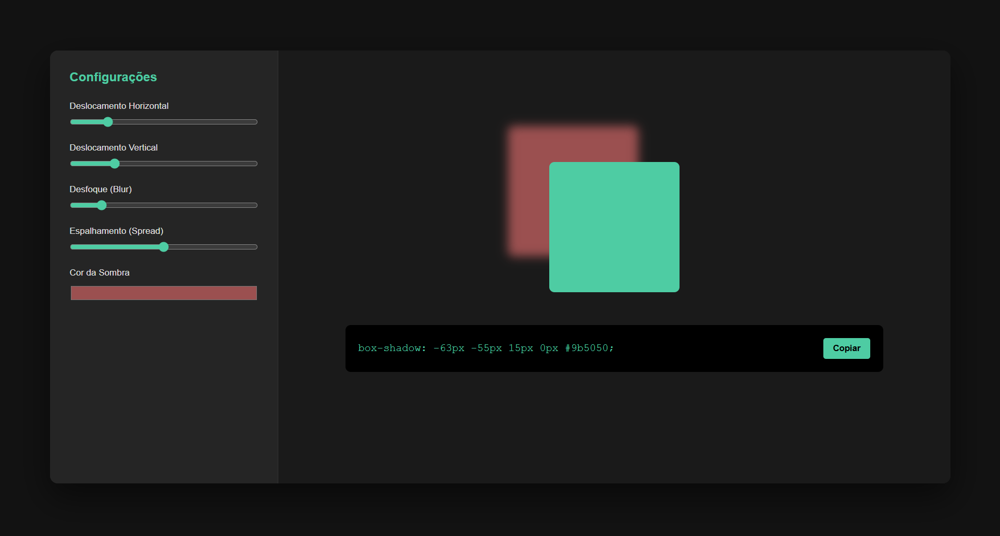

# Shady Box | Box Shadow Generator

> Uma ferramenta interativa e intuitiva para desenvolvedores gerarem códigos de sombras (box-shadow) CSS em tempo real, focada em produtividade e UI Design.



## Sobre o Projeto
O **Shady Box** nasceu da necessidade de visualizar rapidamente como diferentes parâmetros de sombra afetam o visual de um elemento. Em vez de testar manualmente no código, você ajusta os sliders, vê o resultado instantaneamente e copia o código pronto para o seu projeto.

## Tecnologias Utilizadas
O projeto foi construído utilizando o "trio fundamental" do desenvolvimento web, sem frameworks externos, para garantir performance e código limpo:

* **HTML5:** Estrutura semântica dos painéis e controles.
* **CSS3:** Layout moderno utilizando **CSS Grid** e **Flexbox**, além de variáveis para o tema Dark Mode.
* **JavaScript (ES6+):** Lógica de manipulação de DOM para atualização em tempo real e funcionalidade de copiar para o clipboard.

## Funcionalidades
- [x] Ajuste de deslocamento Horizontal e Vertical.
- [x] Controle de Desfoque (Blur) e Espalhamento (Spread).
- [x] Seletor de cores para a sombra.
- [x] Visualização em tempo real.
- [x] Botão "Copiar" que salva o código CSS na sua área de transferência.

## Organização de Pastas
```text
├── assets/          # Imagens
├── src/             # Código fonte do projeto
│   ├── css/         # Estilização (Style.css)
│   └── js/          # Lógica (Script.js)
├── index.html       # Página principal
└── README.md        # Documentação
